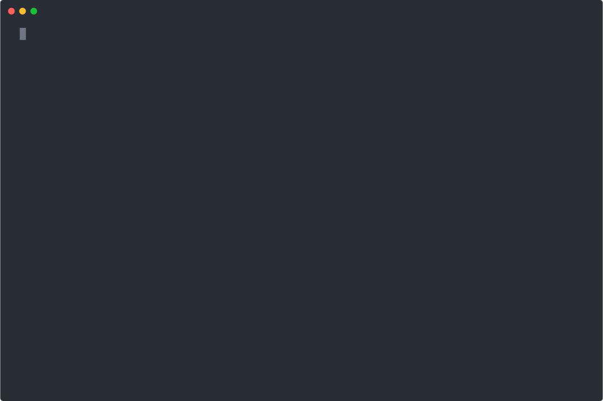

# Aquadirector

Monitor and control your reef aquarium from the terminal — all on your local network, no cloud required.

[](https://go.dev) [](LICENSE) [](https://github.com/marzagao/aquadirector/actions/workflows/ci.yml) [](https://goreportcard.com/report/github.com/marzagao/aquadirector)



## Supported Devices

| Device | Protocol | Status |
|--------|----------|--------|
| **Red Sea ReefATO+** | HTTP (local, port 80) | Working |
| **Red Sea RSLED60** (G2) | HTTP (local, port 80) | Working |
| **Kactoily 7-in-1 Water Sensor** | Tuya v3.5 (local, AES-128-GCM) | Working |
| **Eheim autofeeder+** | HTTP REST (local, Digest auth) | Working |

All device communication happens on your local network. The optional Red Sea cloud integration (notifications, temperature history) can be enabled separately.

## Why aquadirector?

Most aquarium monitoring solutions require a cloud account, a subscription, or a full Home Assistant setup. aquadirector runs as a single binary on your local network:

- **Local-first** — no cloud account needed for Red Sea or Eheim control
- **Scriptable** — all commands support `--output json`; pipe to `jq`, cron-friendly alerts
- **Lightweight** — one binary, no runtime dependencies; Tuya v3.5 implemented natively in Go
- **Composable** — `pkg/redsea`, `pkg/eheim`, and `pkg/tuya` are importable Go libraries

## Requirements

- Go 1.25+
- For initial Kactoily sensor setup only: Python 3 with `tinytuya` (`pip install tinytuya`)

## Install

**macOS (Homebrew):**

```sh
brew install marzagao/tap/aquadirector
```

**Download binary** — macOS and Linux pre-built binaries on [GitHub Releases](https://github.com/marzagao/aquadirector/releases).

**Go install:**

```sh
go install github.com/marzagao/aquadirector@latest
```

**Build from source:**

```sh
git clone https://github.com/marzagao/aquadirector.git
cd aquadirector
make build && make install
```

## Setup

Do this once. Skip any steps for devices you don't have.

### 1. Create a config file

```sh
mkdir -p ~/.config/aquadirector
cp aquadirector.yaml.example ~/.config/aquadirector/aquadirector.yaml
```

### 2. Discover Red Sea devices

```sh
aquadirector discover --subnet 192.168.1.0/24 --save
```

`--save` writes discovered devices directly to your config file.

### 3. Set up the Eheim autofeeder+

The Eheim hub is discoverable at `eheimdigital.local` via mDNS. Discovery runs alongside Red Sea:

```sh
aquadirector discover --save
```

If only one feeder is on the mesh, aquadirector auto-detects it. To configure manually:

```yaml
feeder:
  host: "eheimdigital.local"
  mac: "AA:BB:CC:DD:EE:FF"   # optional if only one feeder on the mesh
```

Verify:

```sh
aquadirector feeder status
```

### 4. Set up the Kactoily sensor

The sensor uses Tuya protocol v3.5 and requires a one-time credential fetch from the Tuya IoT Platform.

See **[docs/setup-kactoily.md](docs/setup-kactoily.md)** for the full walkthrough, including the important note about using Smart Life instead of the Kactoily app, and what to do if the sensor stops responding.

### 5. Set up Red Sea cloud (optional)

Adds 7-day notification history and temperature range to the dashboard.

See **[docs/setup-redsea-cloud.md](docs/setup-redsea-cloud.md)** for instructions, including how to capture the required OAuth2 credentials from the ReefBeat app.

### 6. Verify

```sh
aquadirector dashboard
```

## Usage

```
aquadirector
├── version                              # Print version
├── dashboard (dash)                     # Consolidated aquarium dashboard
├── discover [--subnet X] [--save]       # Scan for Red Sea + Eheim devices
│            [--eheim-host HOST]
├── status [--device NAME|IP]            # All device statuses (online/offline)
├── ato                                  # ReefATO+ commands
│   ├── status [--watch 10s]             # Dashboard (with optional refresh)
│   ├── resume                           # Clear empty state
│   ├── volume [--set ML]                # Get/set reservoir volume
│   ├── mode [--set auto|manual]         # Get/set mode
│   └── config [--set key=value]         # View/update config
├── led                                  # ReefLED commands
│   ├── status [--watch 10s]             # Current light state
│   ├── manual --white N --blue N --moon N
│   ├── timer --white N --blue N --moon N --duration SEC
│   ├── mode [--set auto|manual|timer]
│   └── schedule [--day 1-7] [--set FILE.json]
├── sensor                               # Kactoily water sensor
│   ├── probe [--ip IP]                  # Protocol discovery
│   ├── status [--ip IP] [--watch 10s]   # Read water parameters
│   └── rekey --client-id X --client-secret Y
├── feeder                               # Eheim autofeeder+
│   ├── status [--watch 10s]             # Weight, drum, schedule, settings
│   ├── feed                             # Trigger manual feeding
│   ├── drum full|tare|measure           # Drum management
│   ├── config [--set key=value]         # Overfeeding, feeding break, filter sync
│   ├── schedule                         # View weekly schedule
│   ├── schedule set --day DAY "HH:MM/TURNS"
│   └── schedule clear --day DAY|--all
└── alerts                               # Alerting
    ├── check [--notify]                 # Evaluate rules
    └── config                           # Show alert config
```

**Global flags:**

```
--config FILE    Config file (default ~/.config/aquadirector/aquadirector.yaml)
--output FORMAT  Output format: table, json, yaml (default table)
--verbose        Debug logging
```

### Examples

```sh
# Live water quality in a second terminal, refreshed every 30 seconds
aquadirector sensor status --watch 30s

# Dashboard as JSON for scripting
aquadirector dashboard --output json | jq '.water_quality.ph'

# Set LED to manual
aquadirector led manual --white 100 --blue 50 --moon 10

# Temporary LED override for 1 hour
aquadirector led timer --white 200 --blue 100 --moon 5 --duration 3600

# ATO: check status, then clear an empty state
aquadirector ato status
aquadirector ato resume

# Trigger a manual feed and mark the drum as refilled
aquadirector feeder feed
aquadirector feeder drum full

# Set Monday feeding: 08:00 (2 turns) and 20:00 (1 turn)
aquadirector feeder schedule set --day mon "08:00/2" "20:00/1"

# Clear Tuesday (fasting day)
aquadirector feeder schedule clear --day tue

# Enable overfeeding protection
aquadirector feeder config --set overfeeding=on

# Evaluate alert rules and dispatch notifications
aquadirector alerts check --notify
```

## Alerts

Alerts are configured in `aquadirector.yaml` with threshold rules:

```yaml
alerts:
  enabled: true
  rules:
    - name: "ph_high"
      source: "sensor"      # ato, led, sensor, or feeder
      metric: "ph"
      operator: ">"          # >, <, >=, <=, ==, !=
      threshold: 8.4
      severity: "warning"    # info, warning, critical
      message: "pH is {{.Value}} (above {{.Threshold}})"
  notifications:
    - type: "stdout"
      severity_min: "info"
    - type: "webhook"
      severity_min: "warning"
      url: "https://hooks.slack.com/..."
      body_template: '{"text":"{{.Name}}: {{.Message}}"}'
```

Run via cron for periodic monitoring:

```sh
# Check every 5 minutes
*/5 * * * * /usr/local/bin/aquadirector alerts check --notify 2>&1 | logger -t aquadirector
```

## Disclaimer

This project is not affiliated with, endorsed by, or connected to Red Sea, Eheim, Kactoily, or Tuya. It is independent, community-developed software. All product names are trademarks of their respective owners.

## Documentation

- [docs/setup-kactoily.md](docs/setup-kactoily.md) — Kactoily sensor: Tuya credentials, key rotation
- [docs/setup-redsea-cloud.md](docs/setup-redsea-cloud.md) — Red Sea cloud: notifications and temperature history
- [docs/architecture.md](docs/architecture.md) — package layout and conventions
- [docs/protocols.md](docs/protocols.md) — device protocol and API references
- [docs/contributing.md](docs/contributing.md) — build, test, and contribution guide
